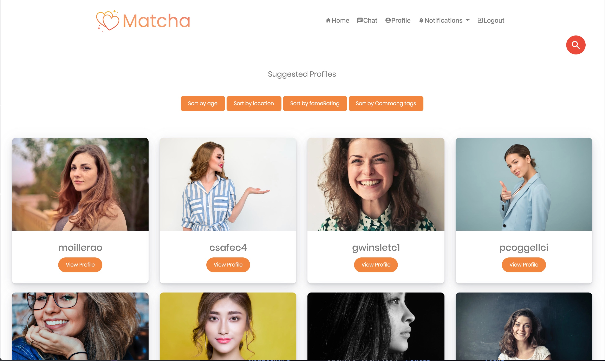
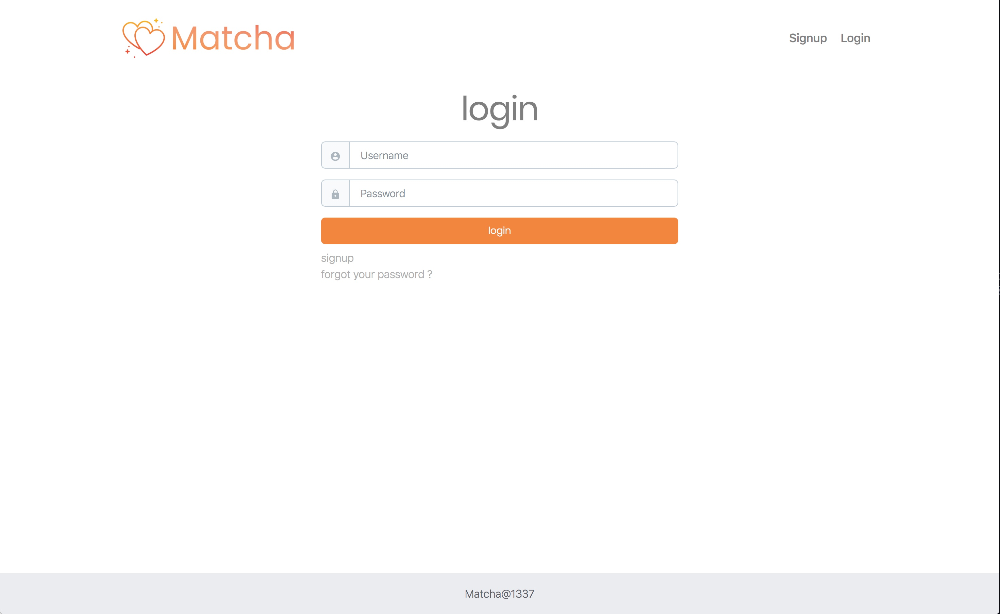
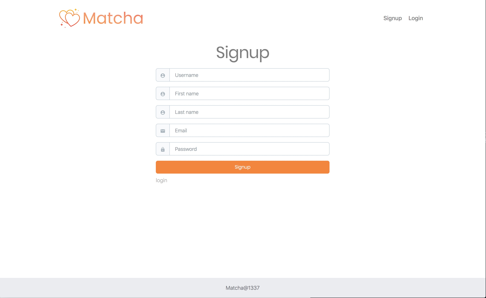
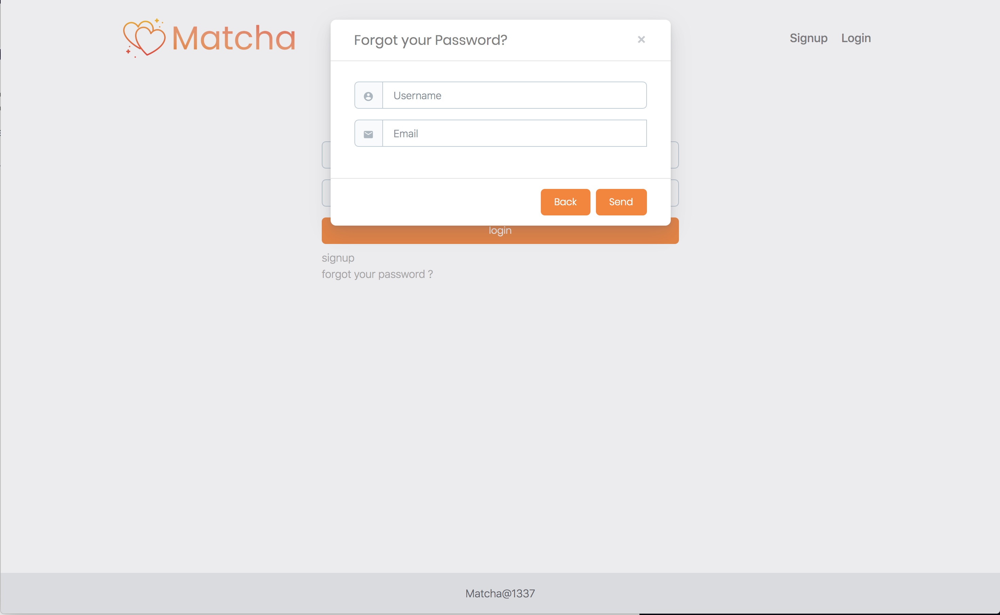
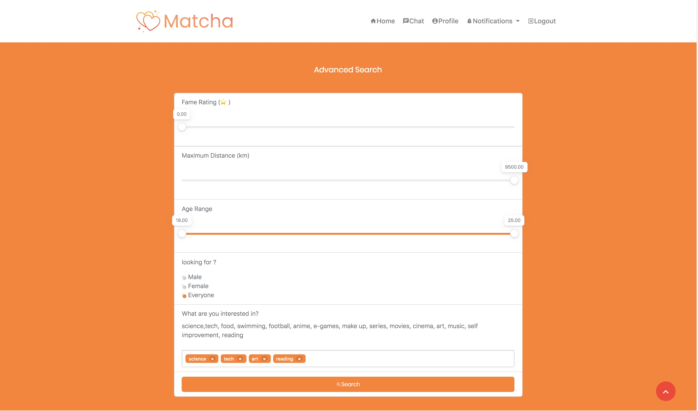
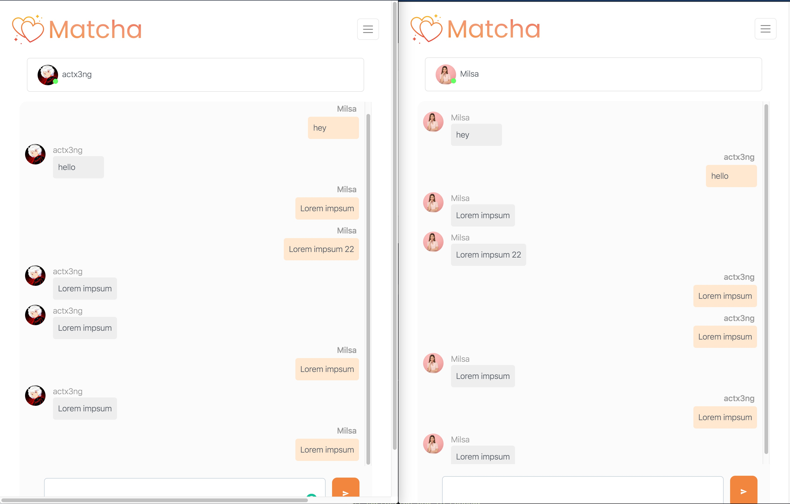
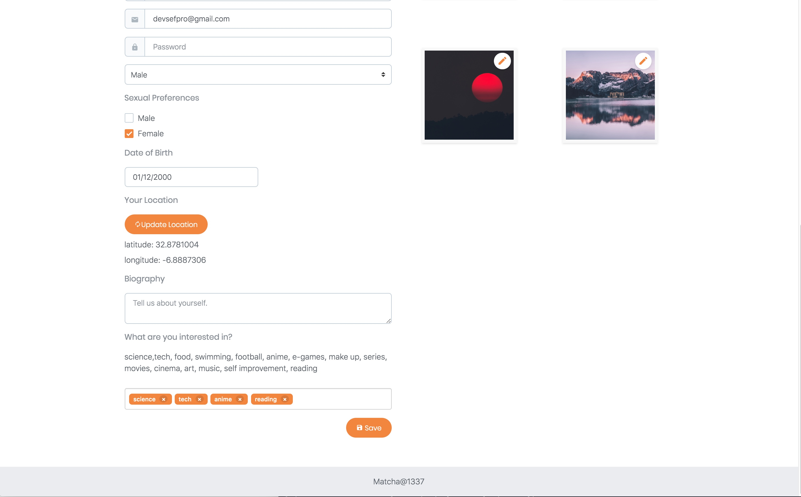
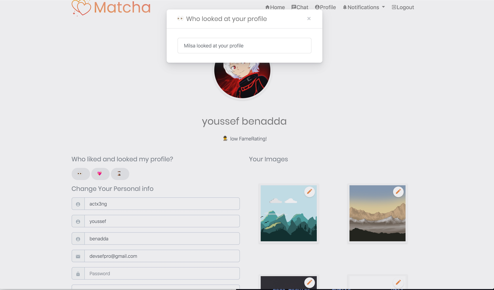
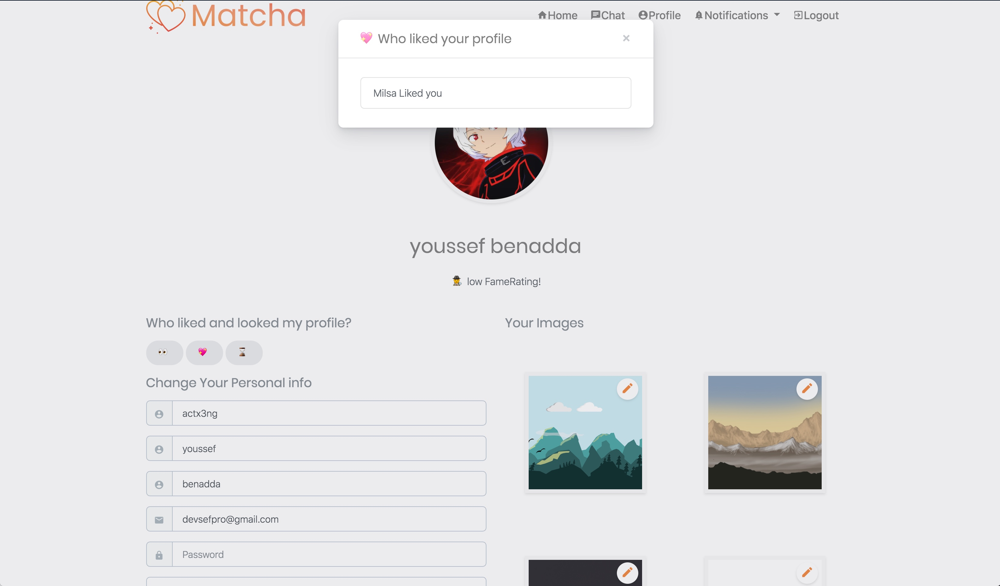
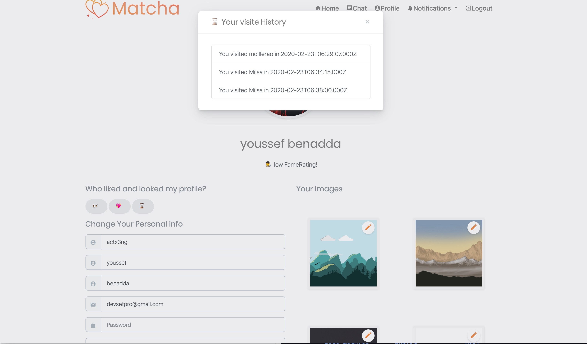

# Matcha 💑

Web Application that allows two potential lovers to meet, from the registration to the final encounter, like (https://tinder.com/).

## 👉 Description 

The app allows user to register asking username, first name, last name, and password, after the registration an email with a unique link set the registered user to verify his account, then the user can login with his/her username and password and he/she able to re-initialize his/her password in case they forgot it. Once connected the user must fill her profile with the following info : the gender, Sexual preferences, a biography, a list of interest with tags, pictures, at any time the user able to modify these information by clicking profile settings, and also the user can check who looked at his/her profile as well as who liked him/her. The user have a public Score of popularity, The user is located using GPS positioning and if does not want to be positioned the app locate him/her using his IP Address and the user can modify his/her GPS position in profile settings. The user able to easily get a list of suggestions that match his/her profile, the system propose interesting profiles Like only men for a heterosexual girls and his matched with same geographic area and maximum of common tags and maximum public score The user able to run an advanced research selecting one or few criteria such as Age gap, Public score gap , a location, one or multiple interest tags The user can consult the profile of other users and when he/she consulte a profile it appear in his/her visit history and he/she can like block or report other user account When two users liked each other they can chat in real time The user is notified in real time when the user received a like, profile has been checked, received a message, liked back, unilked. And for the admin there is a control panel when he/she can check all users in the website and reports and online users and can send email, delete block and account.

## ⚙️ Used Technologies
💅 FrontEnd   : HTML5. CSS3, JAVASCRIPT, EJS

🛠 Backend    : NodeJs (express), Socket io

💾 Database   : MySql

☁️ Deployment : Docker, Github

## 📸 App Screenshots

### ▪️ login Page 

### ▪️ Signup Page

### ▪️ Reset Password Page

### ▪️ Home Page

### ▪️ Search 

### ▪️ Public Profile Page

### ▪️ Chat Page

### ▪️ Profile Settings

### ▪️ who looked to your profile 

### ▪️ who liked your profile 

### ▪️ your visit history

Made with ❤️ @ 1337 School